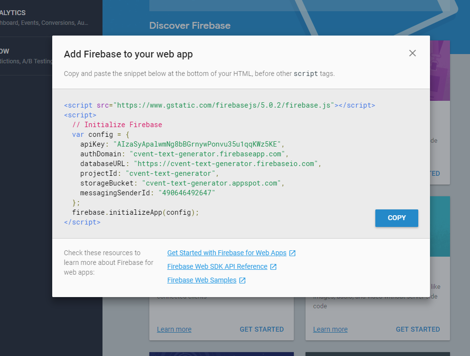
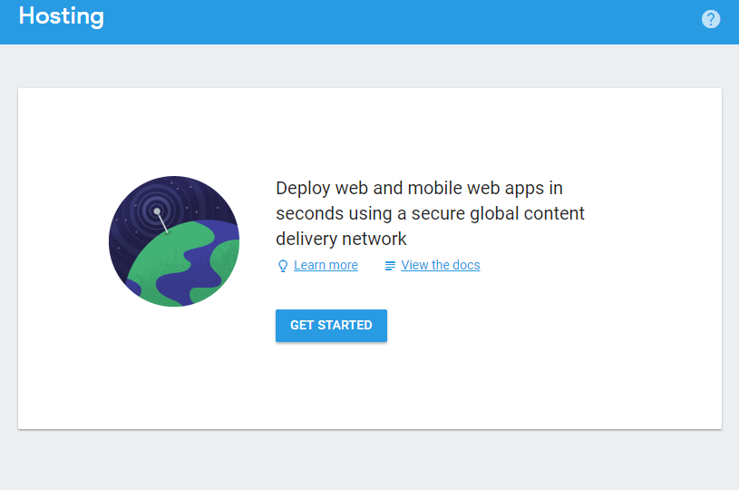
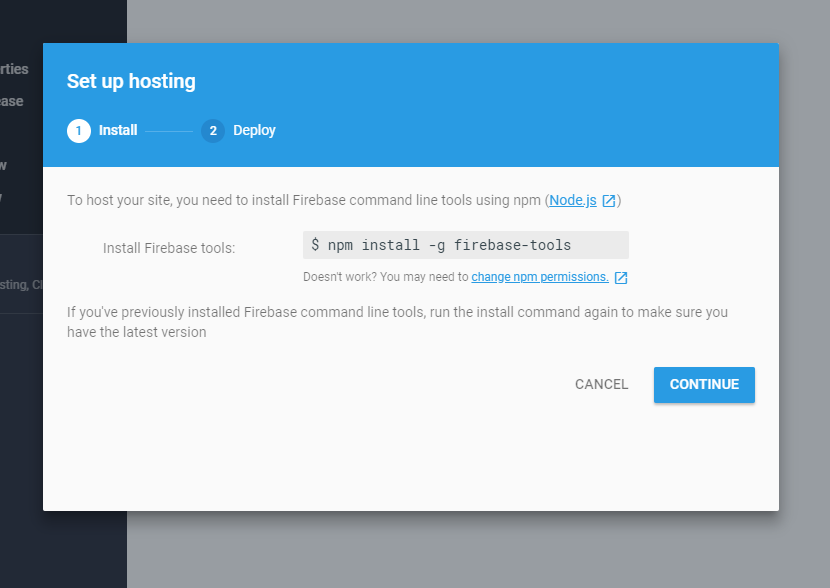
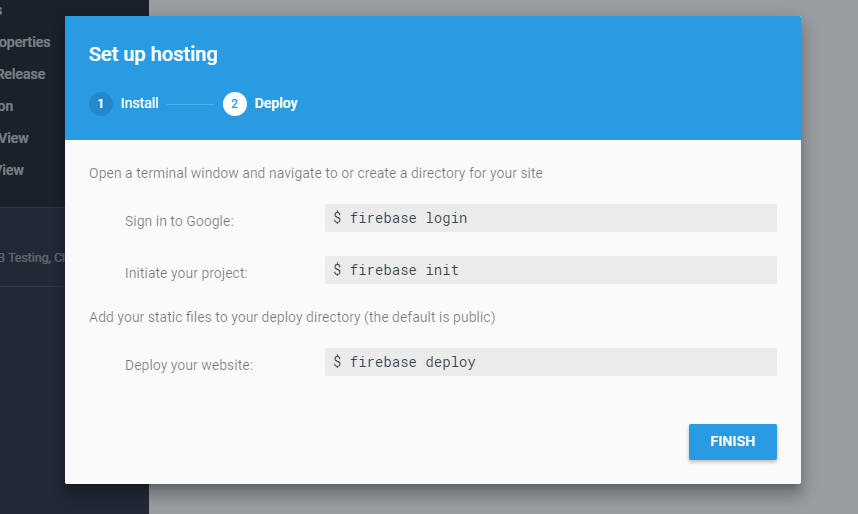
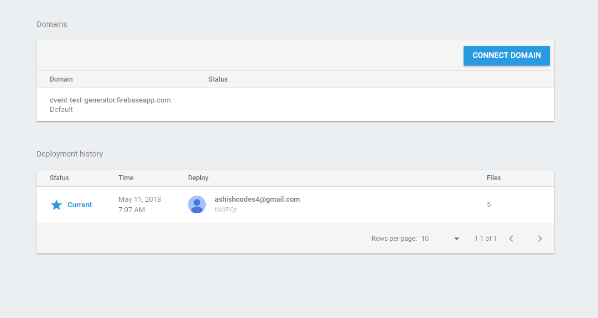

A lot of modern web development stories don’t have good ending because of the complex technologies involved and the development approach adopted to get work done.

The real question is, how can we make this journey less painful, or should I say more fruitful and effective? Ideally the technologies we choose should be well-established and have great community support.

In this article, we’ll look at two technologies that are very well established and have strong community support, that enable us to create live web apps more effectively.

**Prerequisites:**

- You know some React, at least the basics
- You have Node.js and NPM installed
- You know how to use command line

**So here’s what we’re going to cover:**

- Create a simple React application with create-react-app
- Log into the Firebase Console and create a new project
- Deploy it to Firebase Hosting with one simple command

When I initially tried deploying a React web application to Firebase hosting and wanted to get the web app up and running, I faced a few hurdles. I figured out that it may be useful to compile all of the research I’ve carried out into a comprehensive article to help the community. So let’s get started.

At a high level, this article is divided into three parts:

1. Get a very basic React app in place
2. Create a Firebase account
3. Connect our Firebase console to our React app

## Part 1 - create the React app

You likely know that create-react-app myapp is the best way to create a basic boilerplate for a React app. It not only creates a very basic boilerplate, but also adds the required dependencies needed for React to run.

If you don’t realize the true magic and sheer power of this one line command, try creating a directory for React from scratch. Only then will you realize the true pain involved. A big shout out to those developers who got this command set up in the first place.

To get started, we need to get create-react-app installed on our machine.

    npm install -g create-react-app

The -g flag in the command above installs the NPM package globally on the machine.
Once this is done, we’ll use this package to get us a basic boilerplate for React.

    create-react-app myapp

This will create a directory called myapp. Now we need to navigate into the directory and run the command below.

    cd myapp
    npm start

Once you run the command above, a local dev server should start and render the initial React app at the location localhost:3000

I hope that was quick and easy. We have one last step we need to complete, but let’s take a look at Firebase first. We’ll come back to the last step with React after that.

---

## Part 2 - Firebase Setup

Let’s first understand what Firebase is before we dive into setting it up.
Firebase is a mobile and web app development platform that provides developers with a plethora of tools and services to help them develop high-quality apps, grow their user base, and earn more profit.
Let’s have a look at the [history](https://en.wikipedia.org/wiki/Firebase) of Firebase before setting it up.

### A Brief History

Back in 2011, before being known as Firebase, it was a startup called Envolve. Envolve as a product provided developers with an API that enabled the integration of online chat functionality into their website.

The company noticed that developers were using Envolve to sync application data, such as game state in real time, across their users and not just chat messages.

This led the founders of Envolve, James Tamplin and Andrew Lee, to separate the chat system and the real-time architecture. In April 2012, Firebase was created as a separate company that provided Backend-as-a-Service with real-time functionality.

After it was acquired by Google in 2014, Firebase rapidly evolved into the multifunctional behemoth of a mobile and web platform that it is today.

### Firebase Login

So lets begin with this: go to https://firebase.google.com/ and login with your Google account. Once you’re logged in, click on Go to Console. You’ll be presented with an option to Create a new project.

Once the project is created, you have the ability to add Firebase to any Android or iOS mobile app and even a web app.

---

## Part 3 - Firebase & React

Click on the option to Add Firebase to your web app. You’ll get a dialog box with a code snippet.

Add this code snippet to the very bottom of your index.html file in your project. Make sure that this code snippet is added before any of the other script tags in your index.html file.

If you look closely in the image above, you can see that there are some links provided at the very bottom. Click on the first link and check out the Get Started with Firebase for Web Apps. You’ll be presented with the screen below.

Click on get Started.

Go to your root directory and enter the command above in your terminal. This will download the Firebase tools on your machine locally.

The next and the final step is to initialize Firebase and deploy the source code within your directory to Firebase.

Once you hit finish, and you’ve followed all the steps above and entered them into your terminal, you should have a list of last deployment records shown on the web page.

### Re-visiting React, as promised

Remember in the React part above, I said we would get back to do one last thing? We’re going to do that now.

Navigate to the directory where your app is created.

The way React works is that it lets you create a build version. This is a much minified version of all the mammoth code library it sets up if you have a pretty dense application.

To get this minified and compressed version, we can use our terminal and one very useful command:

    npm run build

This creates a new folder in your app directory named build. This folder contains a few files which are the most essential pieces of your entire React application.

---

## Conclusion

If you’ve followed all the steps carefully and have read a bit of the official documentation, all of this should be a cake walk.

Personally, I feel that Firebase has already revolutionized the way developers are testing and using hosting as a service. This is a much simpler and more relaxed way of hosting your apps efficiently, without delving into the details of hosting.
